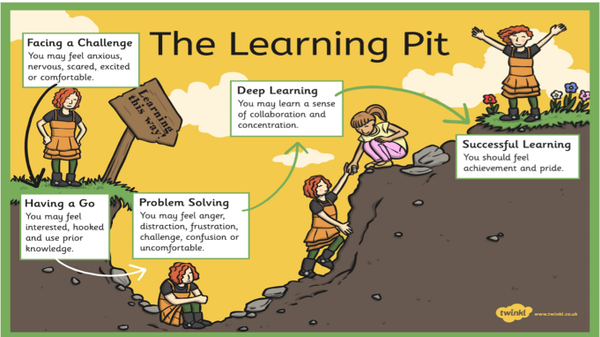
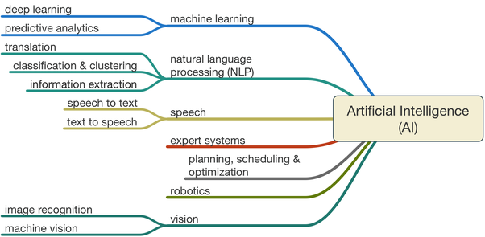
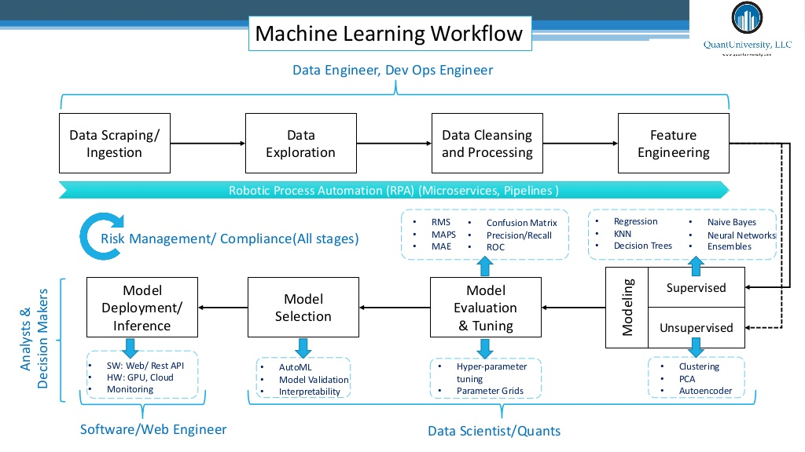

```{r setup, include=FALSE}
knitr::opts_chunk$set(echo = FALSE)
```

# Intro {data-background="HS1slidetemplate2.png" data-background-size="94%"}

## What do you know of deep learning? {data-background="HS1slidetemplate.png" data-background-size="94%"}

{width=500, height=400}

## What is AI? ML? DL? NN? {data-background="HS1slidetemplate.png" data-background-size="94%"}

{height=400}


## What is AI? ML? DL? NN? {data-background="HS1slidetemplate.png" data-background-size="94%"}

{height=600}


## Define AI, ML, DL, NN {data-background="HS1slidetemplate.png" data-background-size="94%"}


## Speakers {data-background="HS1slidetemplate.png" data-background-size="94%"}

- Salesforce
- Twitter
- Change Healthcare
- Facebook
- Fidelity
- GE
- Research hospitals
- CVS / Aetna


## Topics {data-background="HS1slidetemplate.png" data-background-size="94%"}

- AI Ethics
- Embedding
- Speech to Text (language agnostic)
- Object Recognition (eye tracking)
- Attention Mapping (Adobe, focus vs periphery)
- Model Governance
- Cautionary Tales


## Outline {data-background="HS1slidetemplate.png" data-background-size="94%"}

1. Immediate Opportunities
2. Governance
3. Coming Opportunities & Cool Stuff


# Immediate Opportunities {data-background="HS1slidetemplate2.png" data-background-size="94%"}

## Embedding {data-background="HS1slidetemplate.png" data-background-size="94%"}

> Definition: 
> Convert Discrete to Continuous

Uses include:

- Building model features
- Feature compression
- Nearest neighbor search
- Transfer learning


## Speech to Text (Deep Speech) {data-background="HS1slidetemplate.png" data-background-size="94%"}

- Mozilla Firefox
- 10,000 hours required to train the models adequately
- Iara Health: patient record transcribing
    + **Webinars?**
- Common Voice is their tool to crowdsource validation of models
- Future is to convert to Unicode to cover all languages into one model

## BOLA.AI {data-background="HS1slidetemplate.png" data-background-size="94%"}

- Voice charting assistant (think periocharts)
- Boston based four person startup
- Contracts already with Eaglesoft, Curve, and 2nd largest DSO.
- Could do native integration in Dentrix for EHR


# Governance {data-background="HS1slidetemplate2.png" data-background-size="94%"}

## AI Ethics in Product Development {data-background="HS1slidetemplate.png" data-background-size="94%"}

Must maintain ethics in

- Content / Product
- Process

Ethics are defined as:

- As beneficial as possible
- Respect human agency
- Allow human development
- Ensure social justice


## AI Ethics Concerns in Dentistry {data-background="HS1slidetemplate.png" data-background-size="94%"}

- Who's most likely to pay?
- Marketing to potential patients?
- Zip code / Income / Ethnicity


## Model Governance {data-background="HS1slidetemplate.png" data-background-size="94%"}


<!-- they developed their own process/tool, QuSandbox -->


## Model Governance Considerations {data-background="HS1slidetemplate.png" data-background-size="94%"}

- Build models for all parts of the DS process
- Stress & QC test (watch for model decay)
- Can we file IP/Patent the product or algorithm
- Package management
- Hardware needs
- OECD principles standard on AI for Governance

## 4 V's of Big Data {data-background="HS1slidetemplate.png" data-background-size="94%"}

{}

# Coming Opportunities & Cool Stuff {data-background="HS1slidetemplate2.png" data-background-size="94%"}

## AI for Creativity {data-background="HS1slidetemplate.png" data-background-size="94%"}

Human visual system / object recognition shows that we see detail in the middle but not on the periphery.
**See if I can find the Adobe example Zoya ?**
Eye tracking is expensive and difficult. However, Adobe is building a real-time reflow design based on deep learning results. Meaning you change A/B testing to real-time design optimization, or attention mapping.


## Attention Mapping {data-background="HS1slidetemplate.png" data-background-size="94%"}

Not just A/B testing - **any graphic design**

[Zoya](web.mit.edu/zoya/www/docs/UIST2017-importance-reducedfilesize.pdf)


## Challenges {data-background="HS1slidetemplate.png" data-background-size="94%"}

- Calculating costs for being wrong
    + acting on false positives
    + not acting on false negatives


## Suggestions {data-background="HS1slidetemplate.png" data-background-size="94%"}

- Keep Human-in-the-Loop
- Focus on "better" not cheaper
- Need to go live fast, then learn from it
