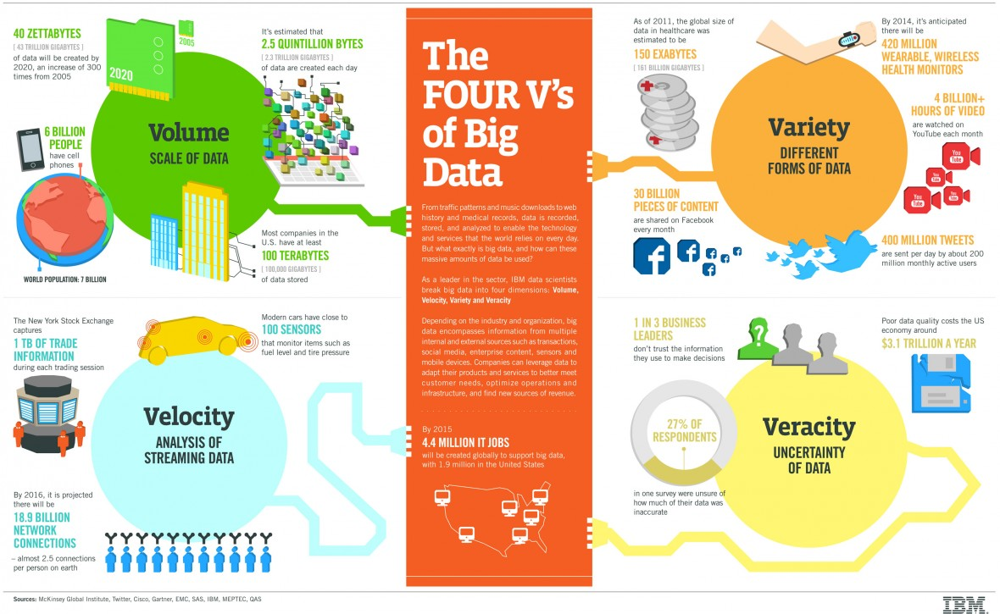

```{r setup, include=FALSE}
knitr::opts_chunk$set(echo = FALSE)
```

## attention grabber

maybe a comic?

## What do you know of deep learning?

insert graphic


## Define AI, ML, DL, NN


## Speakers

- Salesforce
- Twitter
- Change Healthcare
- Facebook
- Fidelity
- GE
- Research hospitals
- ...


## Topics

- AI Ethics
- Embedding
- Speech to Text (language agnostic)
- Object Recognition (eye tracking)
- Attention Mapping (Adobe, focus vs periphery)
- Model Governance
- Cautionary Tales


## Outline

1. Immediate Opportunities
2. Governance
3. Coming Opportunities
4. Fun / Cool Stuff


## Embedding

> Definition: Convert Discrete to Continuous

Uses include:

- Building model features
- Feature compression
- Nearest neighbor search
- Transfer learning


## Speech to Text (Deep Speech)

- Mozilla Firefox
- 10,000 hours required to train the models adequately
- Iara Health: patient record transcribing
    + **Webinars?**
- Common Voice is their tool to crowdsource validation of models
- Future is to convert to Unicode to cover all languages into one model

## BOLA.AI

- Voice charting assistant (think periocharts)
- Boston based four person team
- Contracts alreay with Eaglesoft, Curve, and 2nd largest DSO.
- Could do native integration in EHR


## AI Ethics in Product Development

Must maintain ethics in

- Content / Product
- Process

Ethics are defined as:

- As beneficial as possible
- Respect human agency
- Allow human development
- Ensure social justice


## AI Ethics Concerns in Dentistry

- Who's most likely to pay?
- Marketing to potential patients?
- Zip code / Income / Ethnicity


## AI for Creativity

Human visual system / object recognition shows that we see detail in the middle but not on the periphery.
**See if I can find the Adobe example Zoya ?**
Eye tracking is expensive and difficult. However, Adobe is building a real-time reflow design based on deep learning results. Meaning you change A/B testing to real-time design optimization, or attention mapping.

## Attention Mapping

Not just A/B testing - **any graphic design**


## Model Governance

Quant University Data Flow recreated in Lucid
they developed their own process/tool, QuSandbox


## Model Governance Considerations

- Build models for all parts of the DS process
- Stress & QC test (watch for model decay)
- Can we file IP/Patent the product or algorithm
- Package management
- Hardware needs
- OECD principles standard on AI for Governance

## 4 V's of Big Data




## Challenges

- Calculating costs for being wrong
    + acting on false positives
    + not acting on false negatives


## Suggestions

- Keep Human-in-the-Loop
- Focus on "better" not cheaper
- Need to go live fast, then learn from it
